# Practica de SSH y SCP

## 1. Configuración de maquinas virtuales

- Crear dos máquinas virtuales A y B
  - Adaptador 1: tipo **NAT**
    - Una máquina con el puerto **2222**
    - La otra con el puerto **2223**
  - Adaptador 2: tipo **Red Interna**
    - Para la comunicación entre máquinas

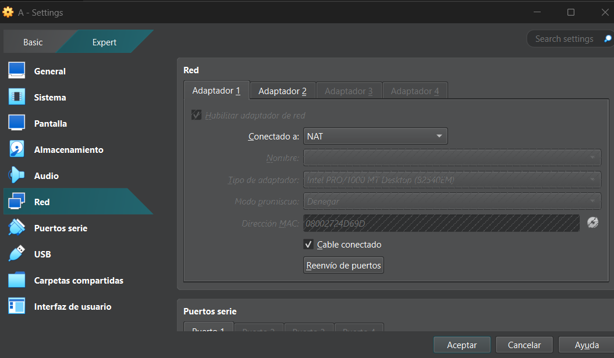

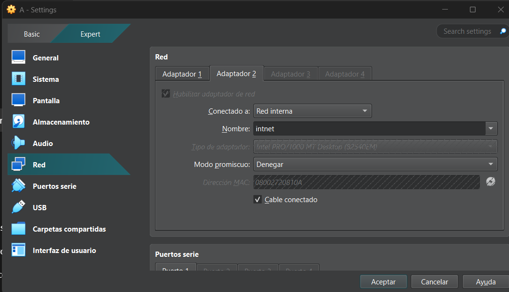

## 2. Conexión por SSH

- Conectarse por SSH a las dos máquinas
- 
  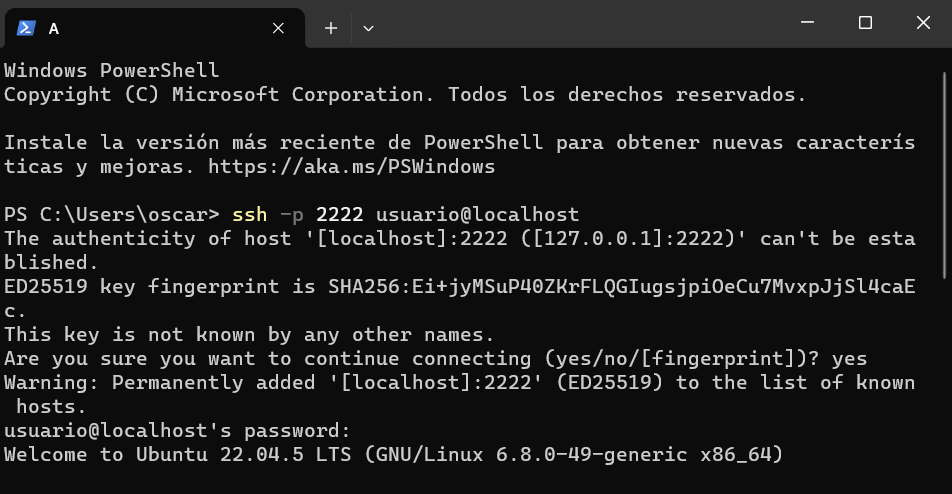
  
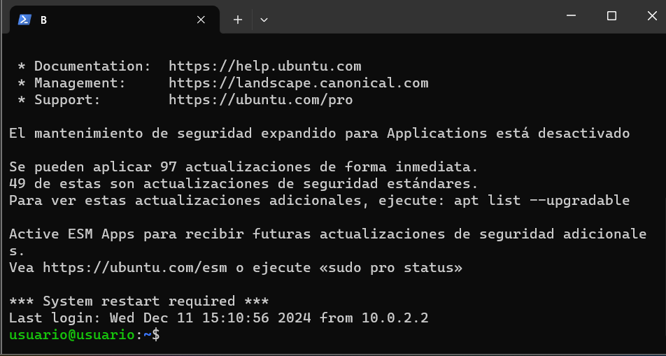

- Añadir los usuarios **Alex**, En la maquina A y **Brais** en la maquina B
  
  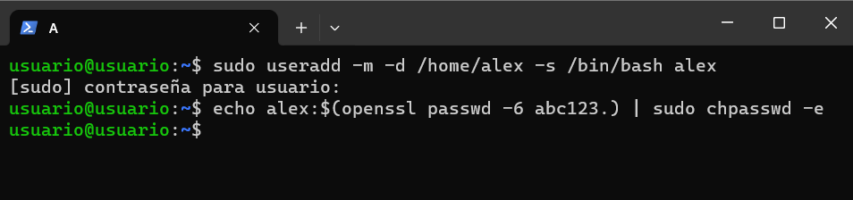
  
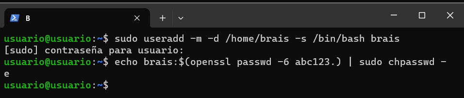

- Configurar la IP de las máquinas

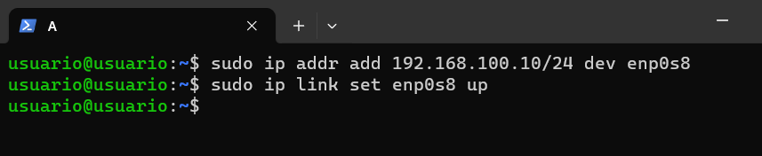

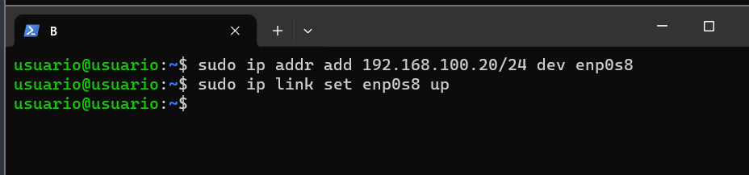

## 3. Prueba de conexión

- Conectar la máquina A a la máquina B

  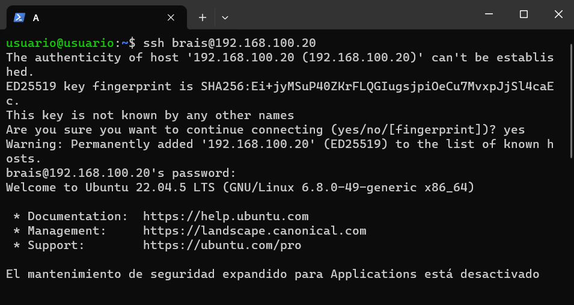
  
- Conectar la maquina B a la maquiba A
  
    
  
  - Crear un directorio en `/tmp`
  - Dejar un archivo como prueba

  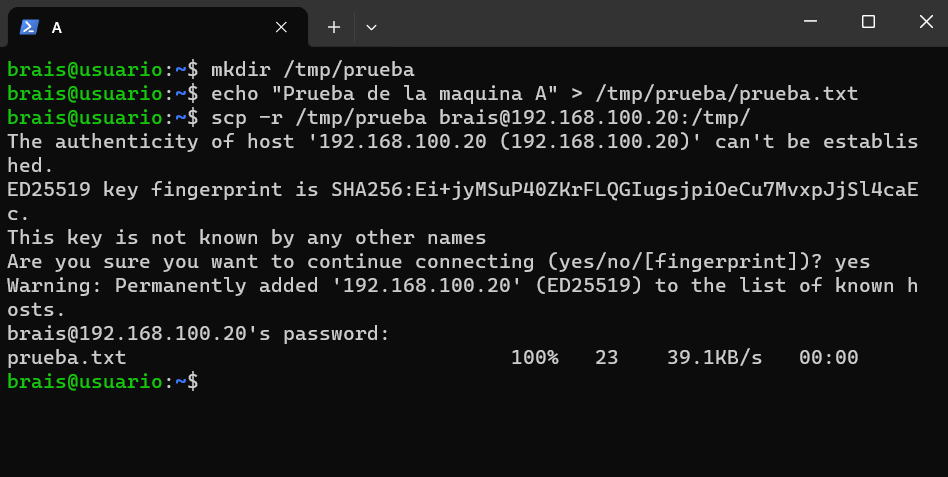

## 4. Copia de archivos

- Copiar desde cada máquina el archivo que creamos antes
- Copiar esos archivos a la maquina real

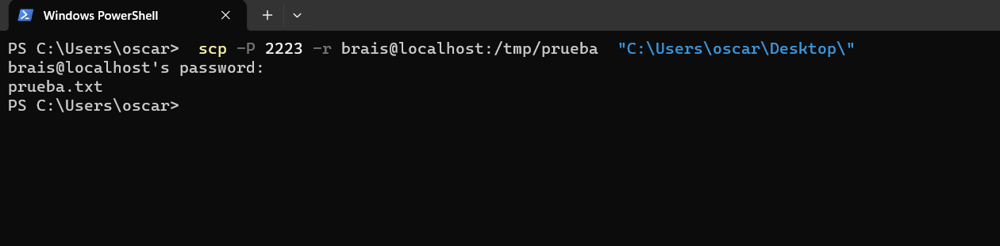

  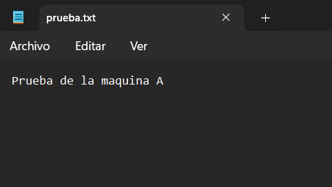
  
## 5. Prueba de carga masiva

- Crear el directorio `prueba3`
- Generar denrto 200 archivos dentro del mismo
  
    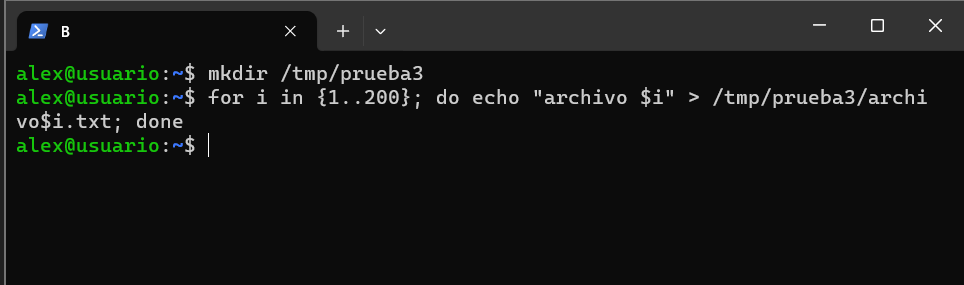
  
- Transferir ese directorio completo a la máquina real

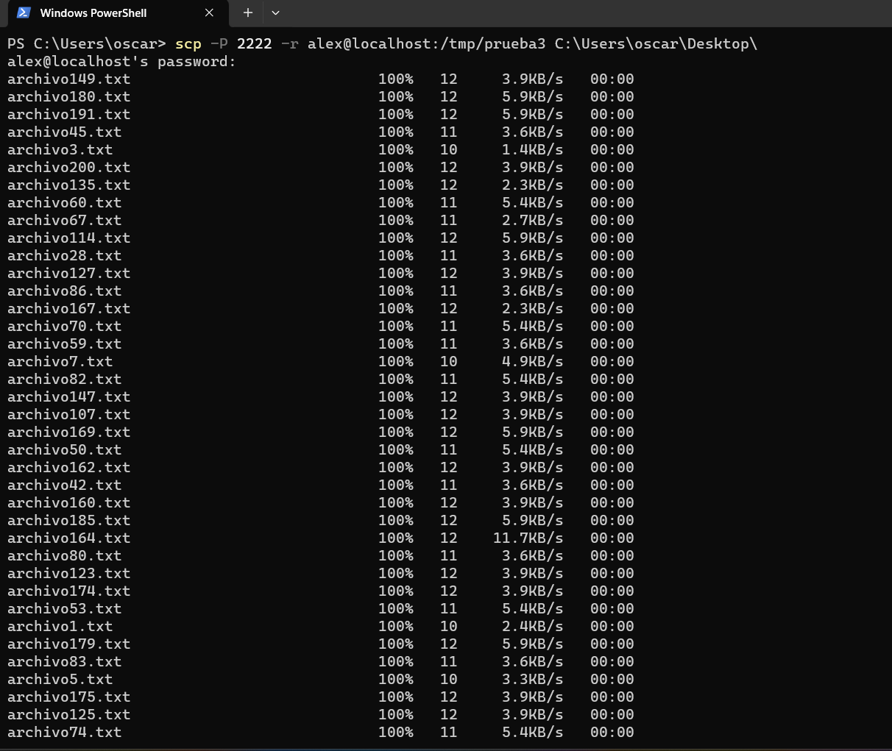

## 6. Autenticación con clave SSH

- Generar clave SSH en la máquina A
  
    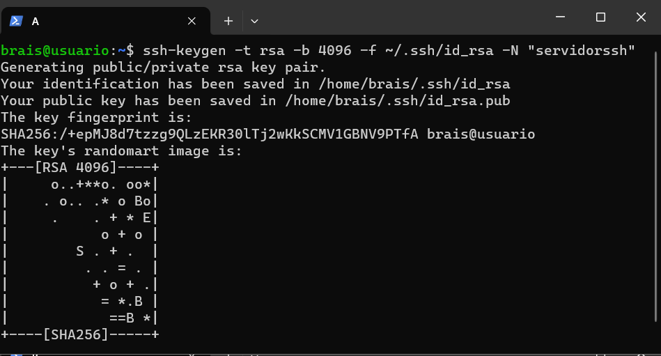
  
- Transferir la clave pública a la máquina B
  
    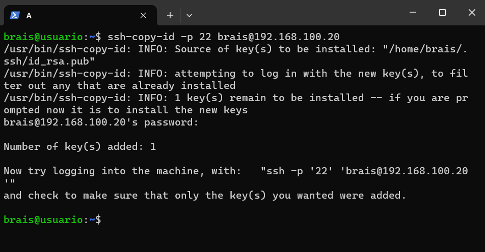

- Verificar la conexión mediante autenticación por frase
  
    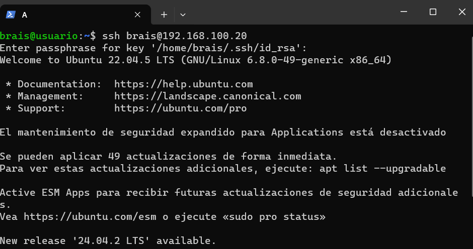

