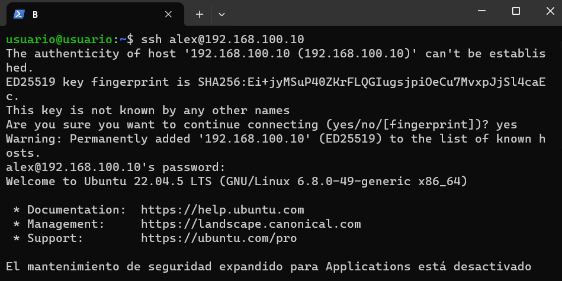

# Tarea de SSH y SCP

## 1. Configuración de las máquinas virtuales

- Crear dos máquinas virtuales (A y B) con sus respectivos adaptadores de red:
  - Adaptador 1: tipo **NAT**
    - Una máquina con el reenvío de puertos predeterminado
    - La otra con el puerto **2223**
  - Adaptador 2: tipo **Red Interna**
    - Para permitir la comunicación entre ambas máquinas

## 2. Conexión por SSH

- Conectarse por SSH a ambas máquinas
- Añadir los usuarios **Alex** y **Brais** en sus respectivas máquinas
- Configurar la IP en ambas máquinas

## 3. Prueba de conexión

- Conectarse desde la máquina A a la máquina B
- Conectarse desde cada máquina a la otra y:
  - Crear un directorio en `/tmp`
  - Dejar un archivo como prueba de haberlo conseguido

## 4. Copia de archivos

- Copiar desde cada máquina el archivo creado anteriormente
- Copiar esos archivos a la máquina nativa

## 5. Prueba de carga masiva

- Crear el directorio `prueba3`
- Generar 200 archivos dentro del mismo
- Transferir ese directorio completo a la máquina nativa

## 6. Autenticación con clave SSH

- Generar clave SSH en la máquina A
- Transferir la clave pública a la máquina B
- Verificar la conexión mediante autenticación por frase (clave)

